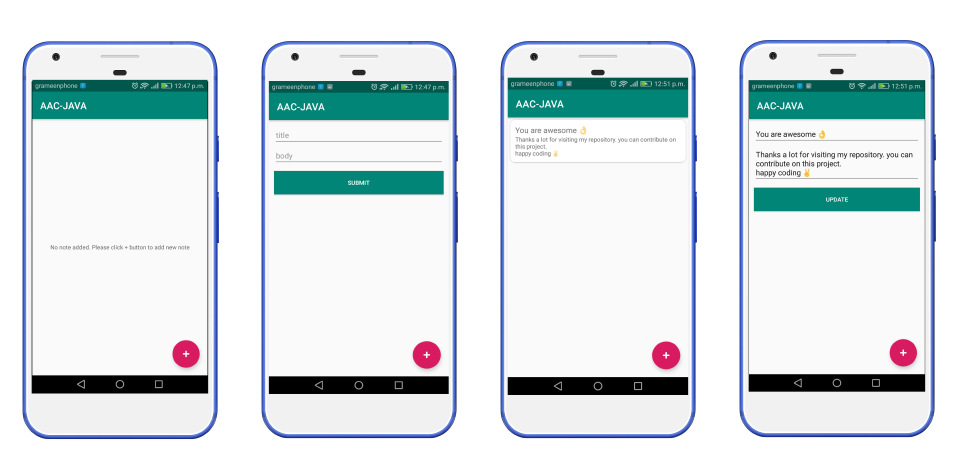

# Android-Architecture-Components-Java

[Android architecture components](https://developer.android.com/topic/libraries/architecture/) are a collection of libraries that help you design robust, testable, and maintainable apps. 
Android Architecture components is part of new [android jetpack components](https://developer.android.com/jetpack/) which is collection of libraries that are individually adoptable and built to work together.

## Android Architecture Components Libraries

* [Data Biniding](https://developer.android.com/topic/libraries/data-binding/)-Declaratively bind observable data to UI elements
* [Lifecycles](https://developer.android.com/topic/libraries/architecture/lifecycle)-Manage your activity and fragment lifecycles
* [LiveData](https://developer.android.com/topic/libraries/architecture/livedata)-Notify views when underlying database changes
* [Navigation](https://developer.android.com/topic/libraries/architecture/navigation/)-Handle everything needed for in-app navigation
* [Paging](https://developer.android.com/topic/libraries/architecture/paging/)-Gradually load information on demand from your data source
* [Room](https://developer.android.com/topic/libraries/architecture/room)-Fluent SQLite database access
* [ViewModel](https://developer.android.com/topic/libraries/architecture/viewmodel)-Manage UI-related data in a lifecycle-conscious way
* [WorkManager](https://developer.android.com/topic/libraries/architecture/workmanager/)-Manage your Android background jobs

## About this project

In this project we will build a note app using android architecture components <B>( LiveData, Room, ViewModel )</B>

### App Features
* Create new note
* Delete an existing note
* Update an existing note
* View all existing notes

## App demo 

## Contributing

Anyone can contribute in this project.

## Authors

**Shantu Chandra Dash** 
* [GitHub](https://github.com/shantudas)
* [Facebook](https://www.facebook.com/shantudashbd)
* [Linkedin](https://www.linkedin.com/in/shantudashbd/)

## License

This project is licensed under the MIT License - see the [LICENSE.md](https://github.com/shantudas/Android-Architecture-Components-Java/blob/master/LICENSE) file for details
